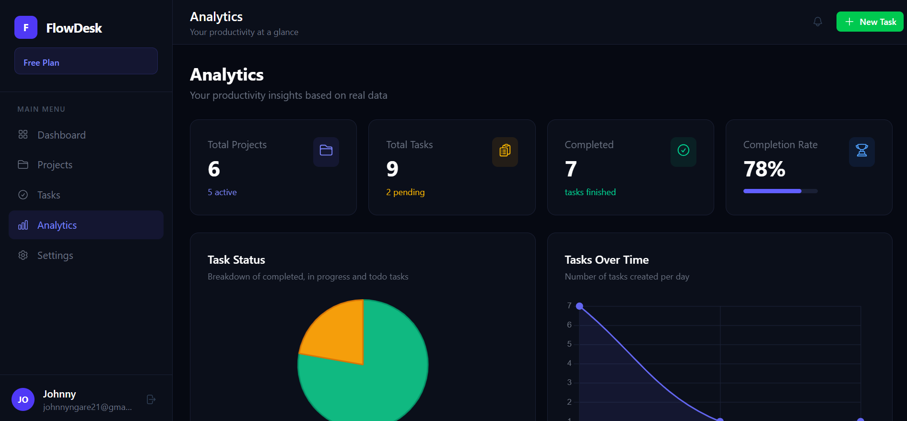
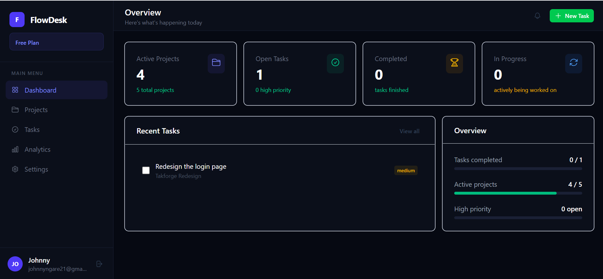
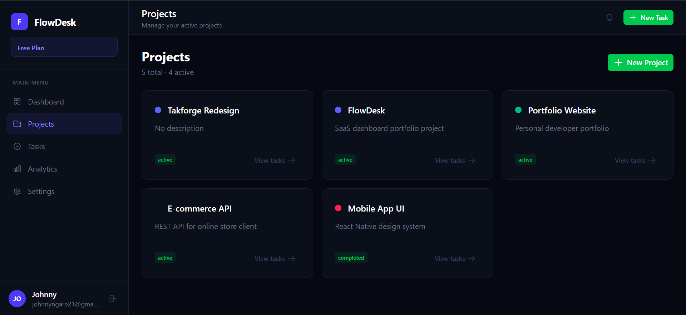
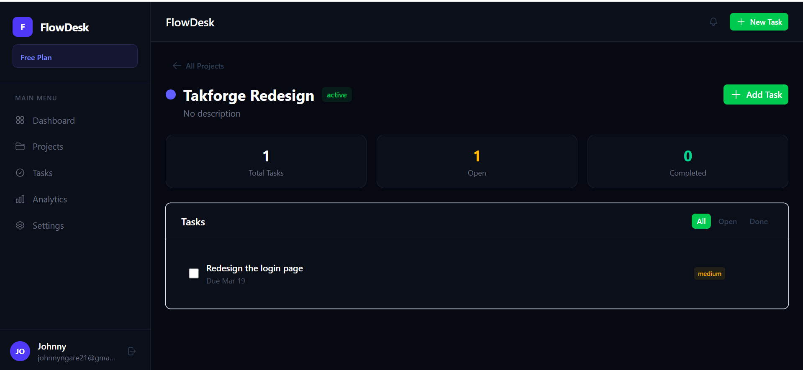

# FlowDesk — SaaS Productivity Dashboard

A full-stack project management SaaS built with Nuxt 3 and Supabase.
Users can manage projects, track tasks, and visualise productivity
through a real-time analytics dashboard.

🔗 **[Live Demo](https://flowdesk-zeta.vercel.app)**  &nbsp;|&nbsp;
📂 **[GitHub](https://github.com/Johnnyngare/flowdesk)**

> Demo account: demo@flowdesk.app / Demo1234!
> (Create this account in your app so recruiters can log straight in)

---



---

## Features

- **Authentication** — Secure signup, login and session management via Supabase Auth
- **Projects** — Create, edit and delete projects with colour labels and status tracking
- **Tasks** — Full task management with priority levels, due dates and completion toggling
- **Project Task Pages** — Dedicated page per project showing linked tasks and progress
- **Analytics Dashboard** — Real charts showing task status, priority breakdown, 
  tasks over time and per-project summaries
- **Global Task View** — Search and filter all tasks across projects by status, 
  priority and project
- **Settings** — Profile management, email and password updates via Supabase Auth API
- **Row Level Security** — Every database query is scoped to the authenticated user

---

## Tech Stack

| Layer | Technology |
|---|---|
| Frontend Framework | Nuxt 3 (Vue 3 Composition API) |
| UI Component Library | Nuxt UI (Tailwind CSS) |
| Backend & Database | Supabase (PostgreSQL) |
| Authentication | Supabase Auth |
| Charts | Chart.js + vue-chartjs |
| State Management | Pinia + Vue Composables |
| Deployment | Vercel |
| Version Control | Git + GitHub |

---

## Architecture
```
flowdesk/
├── pages/
│   ├── dashboard/
│   │   ├── index.vue          # KPI overview
│   │   ├── projects/
│   │   │   ├── index.vue      # Projects grid
│   │   │   └── [id].vue       # Project detail + tasks
│   │   ├── tasks.vue          # Global task list
│   │   ├── analytics.vue      # Charts dashboard
│   │   └── settings.vue       # Account settings
│   ├── login.vue
│   └── signup.vue
├── components/                # Reusable form and card components
├── composables/               # useProjects, useTasks, useAnalytics
├── layouts/                   # Dashboard layout with sidebar
├── middleware/                # Auth route protection
├── server/api/                # Nuxt server routes
└── types/                     # TypeScript interfaces
```

**Data flow:**
```
User Action → Vue Component → Supabase Client SDK
           → PostgreSQL (RLS enforced) → Reactive UI update
```

---

## Database Schema
```sql
-- Users managed by Supabase Auth
projects (id, user_id, name, description, status, color, created_at)
tasks    (id, user_id, project_id, title, priority, status, due_date, created_at)

-- Row Level Security enforced on both tables
-- Users can only read and write their own data
```

---

## Security

- Row Level Security (RLS) enabled on all tables
- All queries filtered by `auth.uid()` at the database level
- Environment variables never committed to version control
- Authentication handled by Supabase — no custom auth code

---

## Local Development
```bash
# Clone the repository
git clone https://github.com/Johnnyngare/flowdesk
cd flowdesk

# Install dependencies
npm install

# Set up environment variables
cp .env.example .env
# Add your SUPABASE_URL and SUPABASE_KEY to .env

# Start development server
npm run dev
```

Open `http://localhost:3000`

---

## Screenshots

| Dashboard | Projects |
|---|---|
|  |  |

| Project Tasks | Analytics |
|---|---|
|  |  |

---

## Future Improvements

- [ ] Stripe subscription billing with free/pro tiers
- [ ] Team workspaces — invite collaborators to projects  
- [ ] Email notifications for due date reminders
- [ ] Drag and drop task reordering (Kanban view)
- [ ] Mobile app via Capacitor

---

## Author

**Johnny Ngare**  
Full Stack Developer  
[GitHub](https://github.com/Johnnyngare) · 
[LinkedIn](https://www.linkedin.com/in/johnny-ngare-55228b229/) · 
[Upwork](https://www.upwork.com/freelancers/~0193eaa3dab3c2c91d)